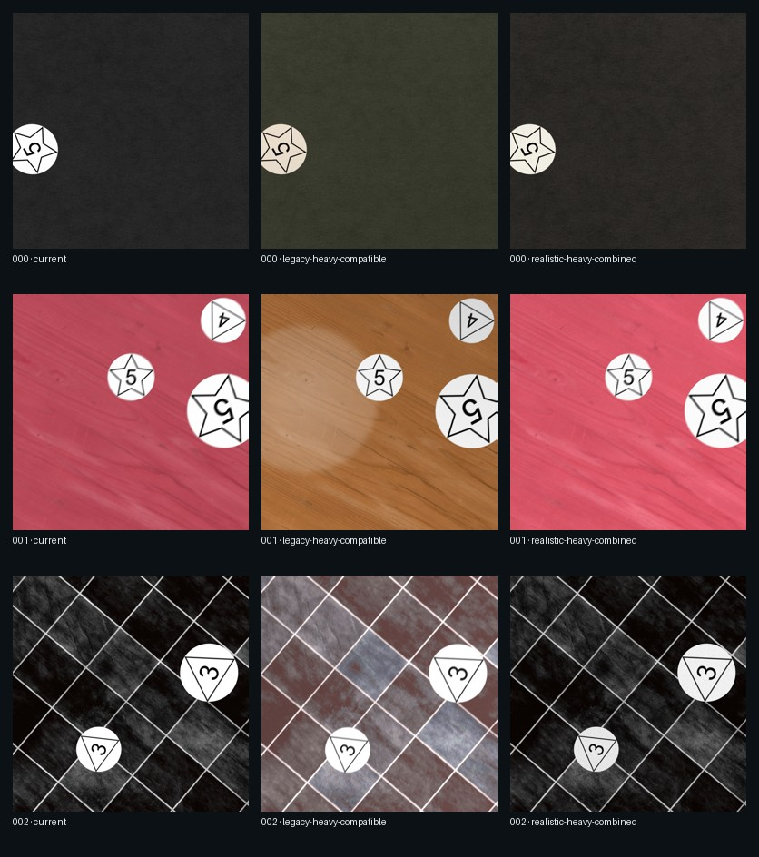

# Augmentation Heavy v1 — Reviewed Conclusion

This review compares appearance treatments on paired landing and manometro fixtures. Every treatment
uses the same scene plan, source choices, background synthesis, geometry, masks, annotations, and output
dimensions. Timings are therefore causal only within the recorded environment; they are not
cross-machine budgets.

## Verdict

- Keep `current` as the default generation behavior.
- Offer `realistic-heavy` only through the explicit generation option. It creates materially stronger
  background, foreground, and final-stage appearance variation while retaining recognizable symbols and
  gauge labels in the reviewed samples.
- Keep `legacy-heavy-compatible` benchmark-only. Its exact supported transforms are preserved, but the
  historical `AtmosphericFog` is approximated with `RandomFog`. The approximation is both visually harsh
  and the dominant exclusive cost: about 4.99 seconds per activation on landing and 2.52 seconds on
  manometro in this environment.
- Keep `all-effects-stress` benchmark-only. It answers a diagnostic question and is not a plausible data
  distribution.

Visual review rejected `RandomFog` from the realistic preset because even reduced settings softened the
entire frame and obscured labels. The final realistic treatment uses low-probability drizzle; its one
landing activation cost about 22–31 ms and preserved legibility. Existing motion blur can still produce
deliberately difficult manometro samples, so future background and visibility calibration should review
that interaction rather than weakening the paired study contract.

## Paired render cost

| Family | Treatment | Mean | p95 | Mean delta vs current |
| --- | --- | ---: | ---: | ---: |
| landing | current | 1.006 s | 1.921 s | baseline |
| landing | realistic-heavy-combined | 2.064 s | 3.813 s | +1.058 s |
| landing | legacy-heavy-compatible | 3.704 s | 9.260 s | +2.699 s |
| manometro | current | 0.340 s | 0.521 s | baseline |
| manometro | realistic-heavy-combined | 0.844 s | 1.456 s | +0.504 s |
| manometro | legacy-heavy-compatible | 1.627 s | 4.598 s | +1.287 s |

For realistic-heavy, background noise and lighting dominate the background stage; plasma lighting and
shadow dominate the final stage. Foreground effects scale with object count and are comparatively modest.
The raw ignored reports include per-call, per-object, per-megapixel, active-parameter, rejection, and
slow-sample detail.

## Review scope

- Windows 11, Python 3.12.13, Albumentations 2.0.8.
- Two warmups and 20 measured fixtures per family, single worker, balanced treatment ordering.
- Identical environment fingerprint for both studies.
- The Git identity was intentionally recorded as dirty because unrelated governance documentation was
  staged for the same pull request; exact source and configuration hashes are retained in the compact
  conclusion.
- Reviewed the synchronized contact sheets and the slowest realistic-combined samples for both families.
- The report UI decision came from the retained `codex/prototype-augmentation-report` branch: synchronized
  contact-sheet rows are primary; slow-sample master/detail and stage/difference views remain secondary
  navigation ideas.

The selected contact sheet is intentionally small and review-oriented. Complete HTML, JSONL, JSON, image,
and difference bundles stay under ignored `outputs/experiments/`.

