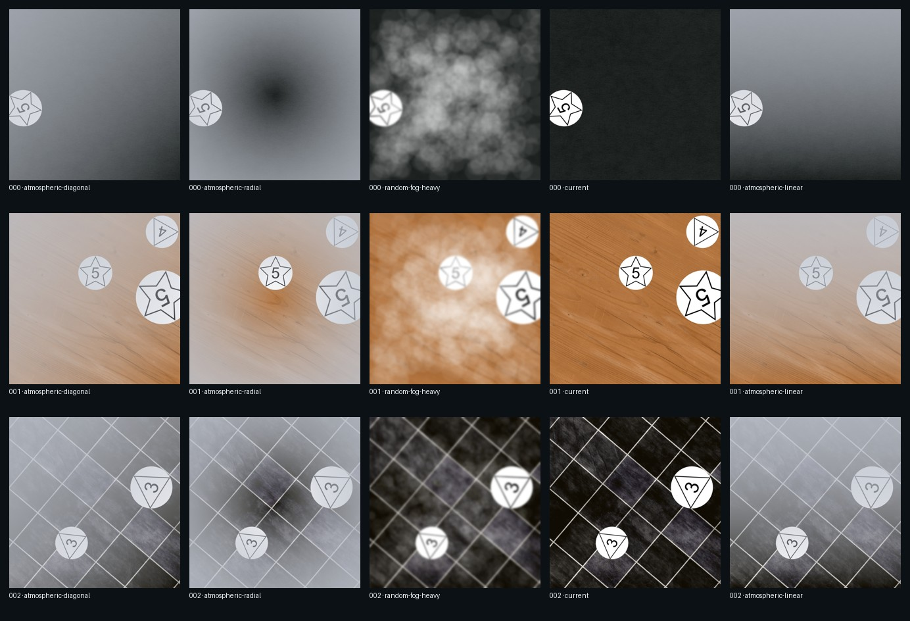

# Native fog comparison v1

Status: reviewed locally on 2026-07-26.

This paired study compares the three native depth-dependent `AtmosphericFog` modes with a no-appearance control and Albumentations' patch-based `RandomFog`. The same scene plan, source choices, geometry, masks, annotations, recipe, dimensions, and effect seeds were held constant across each fixture. Each family used two warm-ups and twenty measured fixtures, one worker, and balanced treatment ordering.

## Decision

- Keep all three native depth modes and RandomFog available; they create materially different results.
- Treat native fog as an ordinary advanced effect whose cost is primarily informative.
- Require explicit preflight acknowledgement for `random-fog-heavy`: it is both much slower and substantially more occluding in this reviewed configuration.
- Do not define cross-machine thresholds. Feed these paired measurements into versioned profile metadata and local ETA calibration.
- Keep `realistic-heavy` as the shipped default; this study does not add fog to that standard preset.

## Performance

All values below are mean render time with p95 in parentheses. They are causal only inside environment `e3c207a55de0…`.

| Family | control | linear | diagonal | radial | RandomFog heavy |
|---|---:|---:|---:|---:|---:|
| landing | 0.506 s (0.833) | 0.638 s (1.154) | 0.619 s (0.878) | 0.605 s (0.812) | 2.861 s (4.509) |
| manometro | 0.231 s (0.350) | 0.336 s (0.410) | 0.339 s (0.451) | 0.395 s (0.550) | 2.415 s (3.558) |

Exclusive native fog calls averaged 0.114–0.138 seconds. Exclusive RandomFog calls averaged 2.197–2.399 seconds. Every top-three slow render in both families used RandomFog.

## Visual review

The synchronized contact sheet shows smooth directional haze for native modes. Linear emphasizes vertical scene depth, diagonal shifts the gradient across corners, and radial increases haze toward the perimeter. RandomFog creates patch clusters and noticeably softens or obscures object detail. The slowest RandomFog samples retained valid annotations and masks, but their visual severity makes suitability a dataset-design decision, not only a performance choice.



## Reproduction

```powershell
uv run python -m dataset_generator_m1 experiment augmentations `
  --config examples/configs/landing_minimal.yaml `
  --matrix examples/experiments/fog_mode_study.yaml `
  --warmups 2 --samples 20 `
  --output-dir outputs/experiments/landing-fog-modes-reviewed
```

Repeat with `manometro_minimal.yaml`. The full raw bundles remain ignored under `outputs/experiments/`; `conclusion.json` is the compact machine-readable reviewed record.
