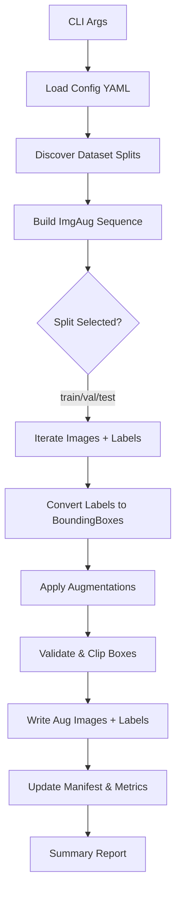

# ImgAug Augmentation Pipeline Specification

## Goal

Build a configurable data-augmentation pipeline using `imgaug` tailored for small aerial base detection datasets similar to the Roboflow-exported YOLO set in `roboflow_augmented_regular/Base-da-CBR-5`. The pipeline must:

- Accept dataset, configuration, and output directories via CLI arguments (no hard-coded paths).
- Apply a curated set of light-to-moderate augmentations derived from `imgaug`'s heavy example but tuned down for structural integrity.
- Preserve and transform bounding boxes/labels compatible with YOLO (`.txt`) while augmenting images.
- Emit an augmented dataset that mirrors YOLO directory structure (`images/`, `labels/`, split subfolders) into a user-defined output directory.

## Functional Scope

1. **CLI entry point**
   - Command: `python -m imgaug_pipeline augment --config configs/default.yaml --input /path/to/dataset --output /path/to/output [--workers 4] [--limit 500]`.
   - Required flags:
     - `--config/-c`: YAML file describing augmentation recipe and I/O defaults.
     - `--input/-i`: Root directory containing `train/`, `valid/`, `test/` (YOLO format) or a `dataset.yaml` pointing to them.
     - `--output/-o`: Target root directory (created if missing) for augmented dataset.
   - Optional flags:
     - `--split {train,val,test,all}`: Subset selection for augmentation.
     - `--limit`: Maximum number of source images per split to augment (for debugging).
     - `--workers`: Parallelism toggle for augmentation workers.
     - `--seed`: Random seed override.

2. **Configuration file (`configs/default.yaml`)**
   - Describe augmentation groups (geometric, photometric, noise) with enable flags and probability ranges.
   - Include dataset defaults (e.g., expected image extension patterns) and I/O behaviors (overwrite policy, keep originals?).
   - Support parameter overrides through CLI `--config` or environment variable.

3. **Processing workflow**
   1. Parse CLI arguments and merge with YAML defaults.
   2. Resolve dataset splits (read `data.yaml` when present; else assume `images/` & `labels/`).
   3. Materialize augmentation sequence using `imgaug.augmenters` with deterministic seeds per worker.
   4. Iterate over image/label pairs, load bounding boxes, apply augmentations, validate bounds, and write outputs.
   5. Generate augmented label files in YOLO format and maintain mapping manifest (`manifest.csv`).

4. **Outputs**
   - Augmented dataset in YOLO folder structure under the provided output path.
   - Summary report (JSON) containing augmentation counts and any skipped samples.
   - Optional debug previews (first N samples) under `debug/`.

## Dataset Assumptions

- Images are RGB JPEGs with resolution roughly 640x640 (consistent with Roboflow export).
- Labels are YOLO txt files: each line `class cx cy w h` normalized [0, 1].
- Class list is provided via `data.yaml` or `names` array; pipeline copies metadata unchanged.

## Augmentation Design

The heavy imgaug recipe uses over a dozen transforms with aggressive ranges. We adopt a **tiered approach** blending light and moderated variants:

### Always-On Core (deterministic order)

- `iaa.Fliplr(p=0.5)`: Horizontal flip with 50% probability.
- `iaa.Crop(percent=(0, 0.05))`: Random crop up to 5% (vs 10% in heavy variant).
- `iaa.LinearContrast((0.85, 1.25))`: Maintain contrast close to original.

### Geometric Sometimes (p = 0.3)

- `iaa.Affine` with mild ranges: scale 0.9–1.1, translate ±10%, rotate ±10°, shear ±5°.
- `iaa.PerspectiveTransform(scale=(0.0, 0.02))` (replaces stronger affine/elastic combos).

### Texture Noise Bundles

Two independent bundles control texture perturbations, mirroring `augment.texture_noise` in the YAML config:

1. **Blur bundle** (`blurs`)
    - Applied with the configured probability (default `0.6`).
    - Picks 1–2 augmenters from the blur family in random order:
       - `iaa.GaussianBlur((0.3, 1.3))`.
       - `iaa.MotionBlur(k=13, angle=(-60, 60))`.

2. **Perturb bundle** (`perturb`)
    - Applied separately (default probability `0.8`).
    - Draws 2–4 augmenters from non-blur perturbations:
       - `iaa.AdditiveGaussianNoise(scale=(0.0, 0.20*255), per_channel≈0.3)`.
       - `iaa.Dropout((0.0, 0.02), per_channel=0.05)`.
       - `iaa.Sometimes(0.7, iaa.Cutout(...))` with tunable iterations/size/fill.
       - `iaa.Add((-10, 10), per_channel≈0.3)` for brightness shifts.

### Color Tweaks Sometimes (p = 0.4)

- `iaa.Multiply((0.9, 1.1), per_channel=0.2)`.
- `iaa.WithHueAndSaturation(iaa.AddToHueAndSaturation((-8, 8)))`.
- `iaa.Grayscale(alpha=(0.0, 0.2))` (light desaturation).

### Bounding Box Integrity

- Convert YOLO boxes to `BoundingBoxesOnImage` before augmentation.
- After augmentation, clip boxes to image size and discard boxes with <5% area overlap vs original (configurable threshold) to avoid invalid labels.
- Warn when all boxes drop (skip sample unless `allow_empty` flag is set).

## Pipeline Diagram

## Error Handling & Logging

- Structured logging with `rich` or `loguru` (configurable level).
- Skip files with missing label pairs, record them in summary under `skipped`.
- Catch `imgaug` runtime warnings (e.g., bounding boxes fully outside) and downgrade to log entries unless `--strict` flag is set.

## Performance Considerations

- Optional multiprocessing using joblib or concurrent.futures (process pool) per split.
- Lazy loading of images to minimize memory footprint; batch size configurable.
- Cache compiled augmentation pipeline and deterministic seeding per worker to ensure reproducibility.

## Testing Strategy

- Unit tests for CLI argument parsing and config merging, YOLO ↔ imgaug bounding box conversion, and augmentation pipeline builder parameter ranges.
- Integration smoke test using a tiny synthetic dataset within `tests/fixtures` to ensure output directories and manifest are generated.

## Roadmap Extensions

- Add segmentation mask support using `SegmentationMapsOnImage`.
- Provide augmentation previews via notebooks or FastAPI microservice.
- Support class filtering for oversampling rare classes prior to augmentation.
- Offer export helpers for other formats (COCO, Pascal VOC).
